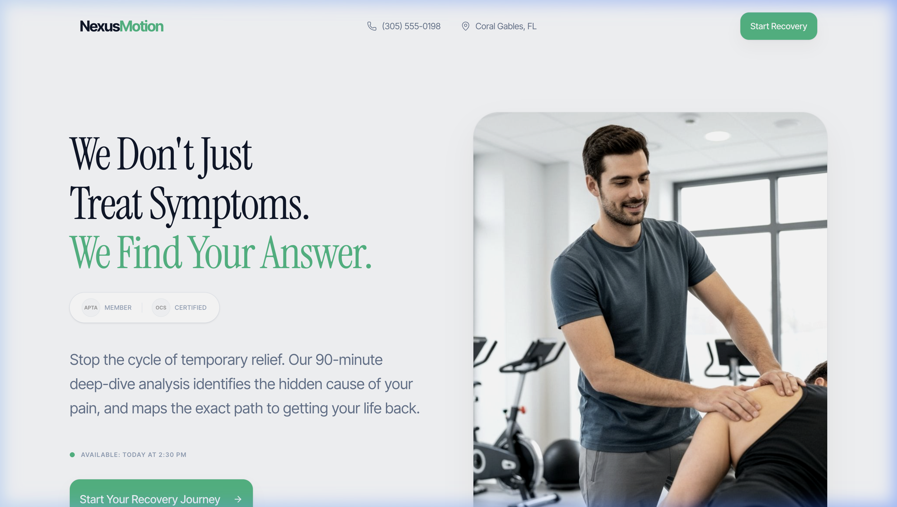
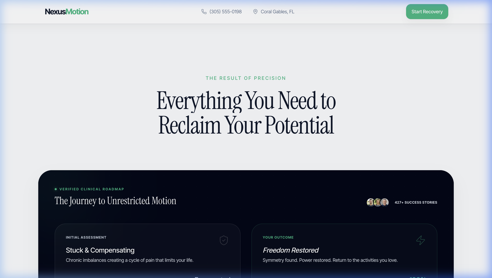

# 🏃 NexusMotion – Physical Therapy Landing Page

> **Live Demo:** [v0-nexus-motion-landing-page-three.vercel.app](https://v0-nexus-motion-landing-page-three.vercel.app)

A **premium physical therapy clinic landing page** for NexusMotion — a specialist clinic in Coral Gables, FL. Designed to convert visitors into patients through trust-building content, clinical credibility badges, and a clear recovery journey roadmap.

---

## 📸 Screenshots

### Hero Section


### Features & Recovery Journey


---

## ✨ Features

| Feature | Description |
|---|---|
| 🎯 **High-Converting Hero** | Bold serif headline + photo split layout drives immediate engagement |
| 🏅 **Trust Badges** | APTA Member & OCS Certified credentials displayed prominently |
| 🟢 **Live Availability** | Real-time appointment slot indicator ("Available: Today at 2:30 PM") |
| 🗺️ **Clinical Roadmap** | Step-by-step "Journey to Unrestricted Motion" with before/after states |
| 📊 **Social Proof** | 427+ success stories counter with patient avatar stack |
| 🎨 **Premium Light Theme** | Clean off-white background with deep navy text and green accents |
| 📱 **Fully Responsive** | Mobile-optimized layout and navigation |
| 📞 **Direct Contact** | Phone number and location visible at all times in the navbar |

---

## 🛠️ Tech Stack

- **Next.js / React** – Component-based SPA
- **Tailwind CSS** – Utility-first styling
- **v0 by Vercel** – AI-generated UI components
- **Vercel** – Instant deployment

---

## 🎨 Design System

```css
/* Color Palette */
--primary-green:  #22C55E;  /* CTA buttons & accent text */
--dark-navy:      #0F172A;  /* Headings & dark sections */
--background:     #F1F5F9;  /* Light page background */
--card-dark:      #111827;  /* Feature card background */
```

**Typography:**
- `Playfair Display` / Editorial serif – Large headings
- `Inter` – Body text and UI elements

---

## 📁 Project Structure

```
nexus-motion-landing-page/
├── app/
│   ├── page.tsx            # Main landing page
│   ├── layout.tsx          # Root layout
│   └── globals.css         # Global styles
├── components/
│   ├── hero.tsx            # Hero section with split layout
│   ├── features.tsx        # Recovery journey roadmap
│   ├── social-proof.tsx    # Testimonials & stats
│   └── navbar.tsx          # Sticky navigation
└── screenshots/
    ├── hero.png
    └── features.png
```

---

## 📊 Key Stats (from the website)

- **427+** success stories from patients
- **90-minute** deep-dive initial analysis
- **APTA Member** – American Physical Therapy Association
- **OCS Certified** – Orthopedic Clinical Specialist
- 📍 Coral Gables, FL
- 📞 (305) 555-0198

---

## 🧭 Recovery Journey (Clinical Roadmap)

| Phase | State | Description |
|---|---|---|
| **Initial Assessment** | Stuck & Compensating | Chronic imbalances creating a cycle of pain |
| **Precision Analysis** | Root Cause Found | 90-minute deep-dive identifies the hidden cause |
| **Treatment Protocol** | Active Recovery | Personalized program targeting the real problem |
| **Final Outcome** | Freedom Restored | Symmetry found, power restored, back to life |

---

## 🚀 Getting Started

```bash
git clone https://github.com/YOUR_USERNAME/nexus-motion-landing-page
cd nexus-motion-landing-page
npm install
npm run dev
```

Open [http://localhost:3000](http://localhost:3000) in your browser.

---

## 🎯 Key Design Decisions

- **Split-screen hero** — photo on the right instantly builds trust with a real therapist image
- **Serif + sans-serif pairing** — editorial feel signals premium medical expertise
- **Green CTA** — stands out against the neutral background without being aggressive
- **Dark feature cards** — contrast creates visual hierarchy and focuses attention on the roadmap
- **"Available today"** badge — urgency without pressure

---

*Built by **Alae Eddine** – KI Architekt & Web Developer*
